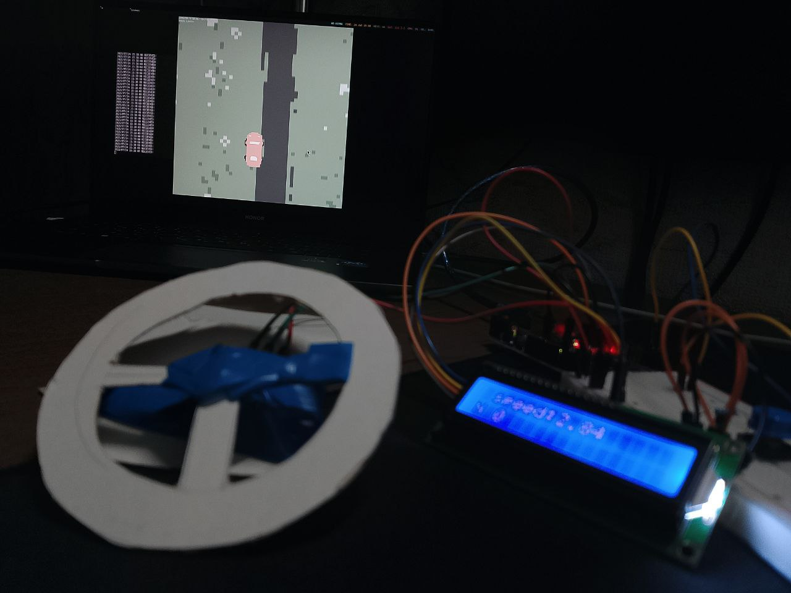
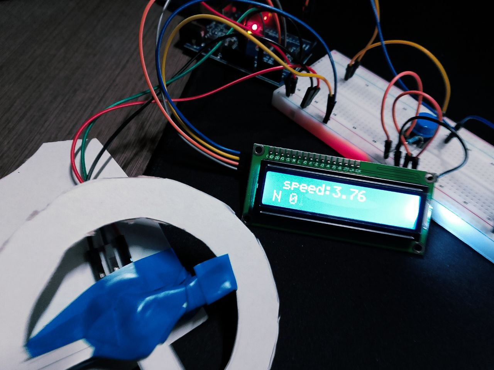
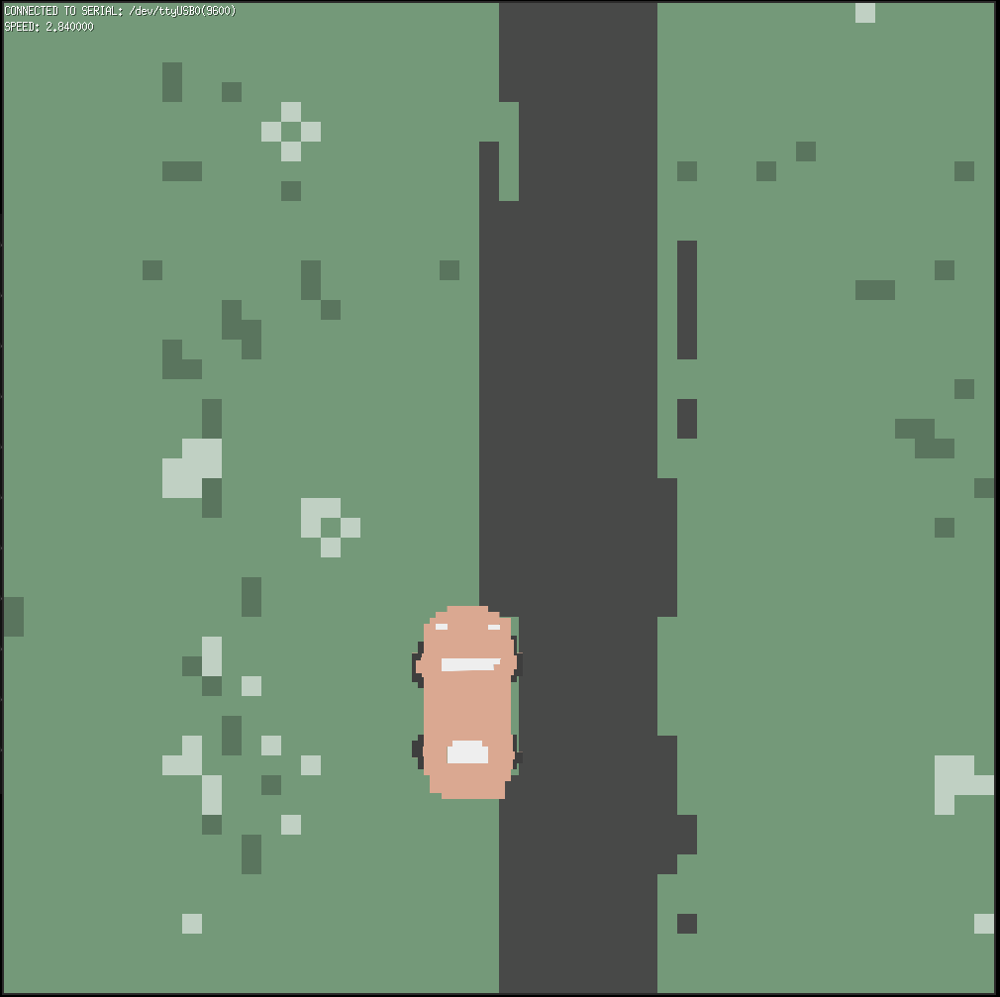

# wheel simulator in arduino

a demo of steering wheel controller for a custom-built game

## demo
https://github.com/user-attachments/assets/6700082d-8b3c-424c-be51-46df1c811ace

## features

*   usage of a potentiometer for smooth steering input.
*   dedicated buttons for gas and brake simulate pedal presses.
*   LCD display for information (speed, direction, factor)

## components

*   arduino uno
*   potentiometer
*   push buttons (x2)
*   LCD display with I2C converter

## how it works

raw input values from the boad are formatted and sent over a serial connection to the computer bridge. the communication is established on the `/dev/ttyUSB0` port (`9600`). the game listens for incoming data, parses the received string of values and updates the car's movement.

1. buttons are connceted to pin 2 and 3
2. LCD display to A4, A5
3. potentiometer to A0

## TODO
- [ ] custom driver to make a real controller out of it (??)
- [ ] improve the game (from 2D to 3D, better movements)
- [ ] add acceleration & smooth movement on steering

## gallery

